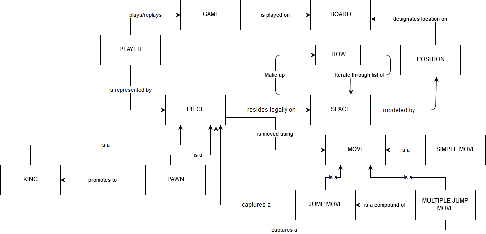
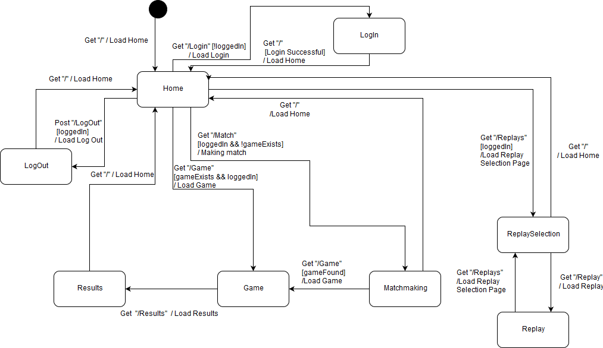
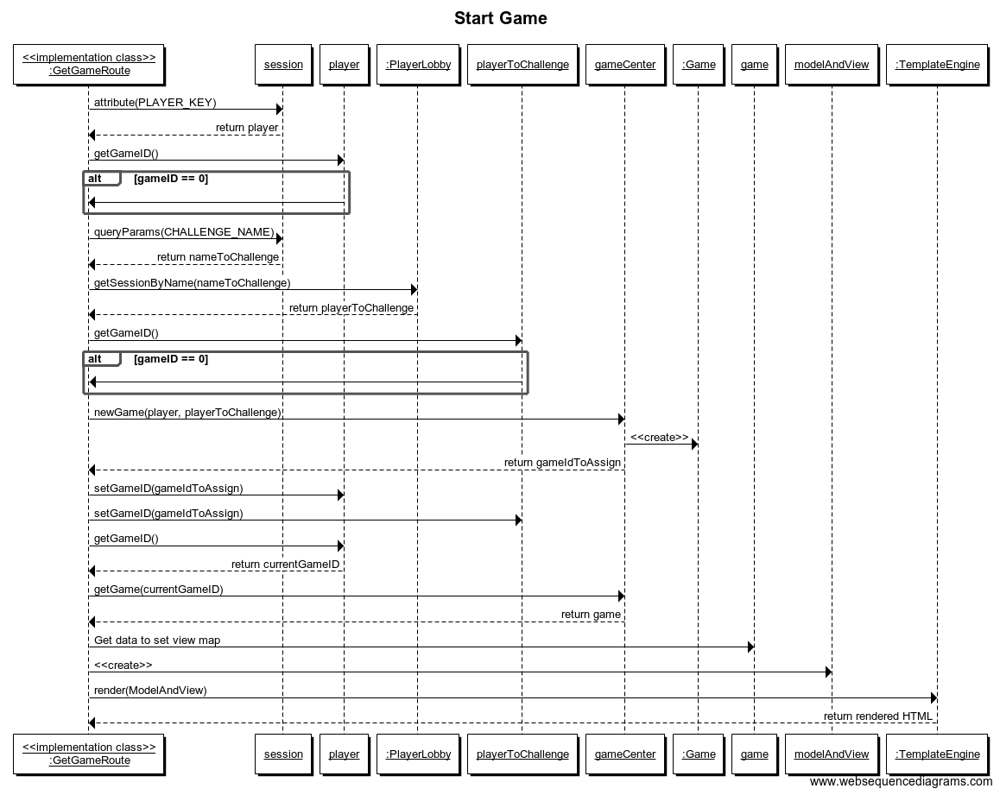
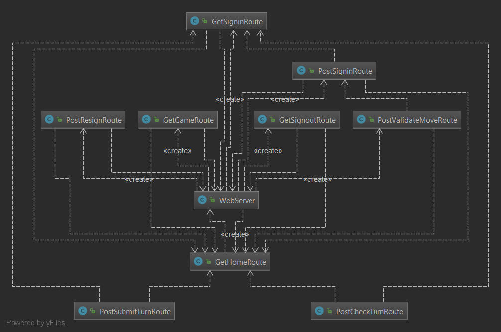
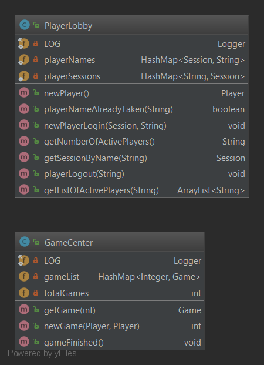
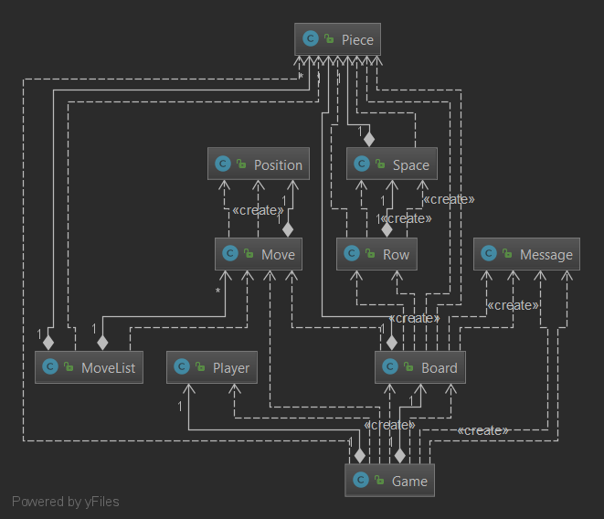
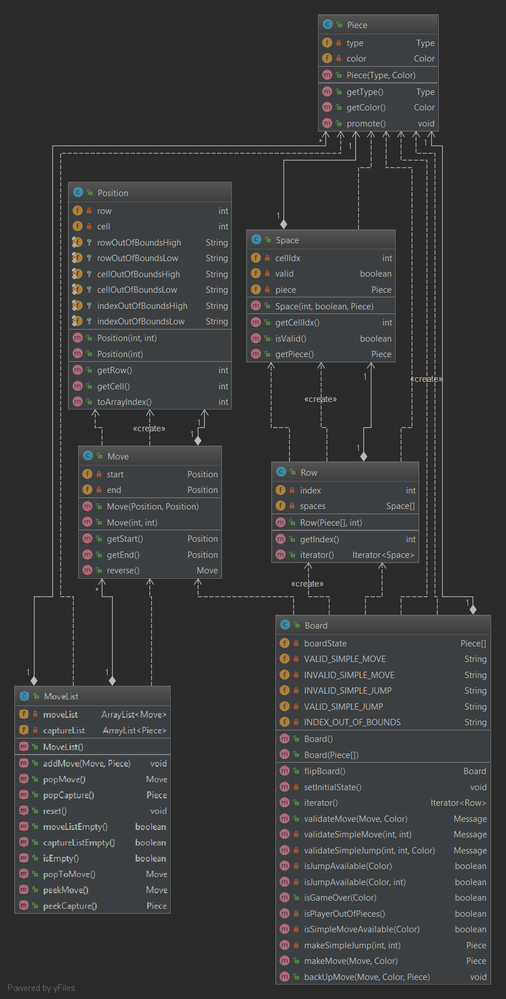

# WebCheckers Design Documentation

> _The following template provides the headings for your Design
> Documentation.  As you edit each section make sure you remove these
> commentary 'blockquotes'; the lines that start with a > character
> and appear in the generated PDF in italics._

## Team Information
* Team name: Team C
* Team members
  * Jonathn Pyc
  * Nathan Harding
  * Ade Osunsina
  * Joey Zhen
  * Christian Brady

## Executive Summary

Team C's latest design is an interactive, online game of Checkers, complete 
with matchmaking, user accounts recording players' wins, loses, and 
current games, and saved replays for viewings of past games.

### Purpose
> _Provide a very brief statement about the project and the most
> important user group and user goals._

### Glossary and Acronyms
> _Provide a table of terms and acronyms._

| Term | Definition |
|------|------------|
| VO | Value Object |

## Requirements

This section describes the features of the application.

> _In this section you do not need to be exhaustive and list every
> story.  Focus on top-level features from the Vision document and
> maybe Epics and critical Stories._

### Definition of MVP
> _Provide a simple description of the Minimum Viable Product._

### MVP Features
> _Provide a list of top-level Epics and/or Stories of the MVP._

### Roadmap of Enhancements
> _Provide a list of top-level features in the order you plan to consider them._

## Application Domain

The Player controls the major aspects of the game: the Game itself and the Pieces they 
use. The Game is represented by the Board. Each Piece can be either a Pawn or, through promotion, 
a King. Each Piece resides on a Space, stored and iterated through by Rows. The Pieces on these  
Spaces reside on a Position on the Board, which will show where the Pieces are located. 
 
Each Piece can make a Move. A Move can be a Simple Move, a single Jump Move, or Multiple Jump Moves. 
The Simple Move only changes the Piece's location to a legal position. The Jump Move will  
jump over a rival Player's Piece and eliminate that jumped piece. The Multiple Jump Move  
compounds two or more legal Jump Moves until the Player stops making Jump Moves. 

## Architecture and Design

This section describes the application architecture.

### Summary

The following Tiers/Layers model shows a high-level view of the webapp's architecture.

As a web application, the user interacts with the system using a
browser.  The client-side of the UI is composed of HTML pages with
some minimal CSS for styling the page.  There is also some JavaScript
that has been provided to the team by the architect.

The server-side tiers include the UI Tier that is composed of UI Controllers and Views.
Controllers are built using the Spark framework and View are built using the FreeMarker framework.  The Application and Model tiers are built using plain-old Java objects (POJOs).

Details of the components within these tiers are supplied below.

### Overview of User Interface

The User Interface initializes with the Home Path, loading the Home Page when starting up.
 The Login Path is displayed only at first in order to load the other User features used in the other paths. 
Once the User has successfully logged in, the Home Page is reloaded, now featuring paths to the Replay,
Matchmaking, LogOut and (optionally) Game pages. 
 
If the Replays Path is taken, the ReplaySelection Page is loaded, which has paths to stored previous
games as Replays. Choosing a specific Replay Path will take the user to a Replay page that display that
Game's replay, and can return to the ReplaySelection Page at any time. One can also return to the Home
Page from the ReplaySelection Page. 
 
The Match Path can be taken at the Home Page to get to the Matchmaking Page, which will allow the user
(if they are logged in) to see other users' requests for an opponent to play a game against. The user
can then choose an opponent and go to a new Game Page, or return to the Home Page. 
 
The Game Page can be entered through either two logged-in users creating a new Game through the Matchmaking Page
or through choosing a specific Game path through the Home Page if the Game was already initialized before
the most recent login. 
 
The Results Path is loaded when the Game played has ended and a winner has been determined. The Results Page
is then displayed, with the only future path being back to the Home Page. 
 
The LogOut Page path is accessed through the Home Page after the User has logged in. This will log the User
out of their account and take them back to the non-logged in Home Page. 

### UI Tier

The UI Tier involves several Routes stemming to and from the base Web Server Class. These routes coordinate
the current player state in the overall application and, once in game, reflect the changes in the board model
that the User has implemented. 
 
The Get... Routes reflect a change the User has directly instantiated through interaction with the webpage,
such as signing in (GetSigninRoute), going to the home page (GetHomeRoute), starting/continuing a game
(GetGameRoute), and signing out(GetSigninRoute). 
 
The Post... Routes takes input from a function the User has indirectly interacted with in order to change
the page's appearance, most of which directly relate to the Game Model.  
The PostSigninRoute handles signing out of the player, while the PostCheckTurnRoute, PostValidateMoveRoute, and the PostSubmitTurnRoute deal
with the current game being played, changing the pieces/board as needed.
 The PostResignRoute deals with directly post-game UI changes, including writing and updating the results and storing them to the Player's stats.
 

 

### Application Tier

The Application Tier consists of two main classes: Which have dominion over the two most important structures
in the program. The GameCenter creates, stores and records the results of each Game instance, each with their own
set of two Players. 
 
PlayerLobby creates, stores and controls all the Players instances and their statuses, whether they are actively and/or
playing a game or logged out. It holds the conditions of all recorded players' sessions.
 

### Model Tier

The Model Tier consists of all back-end components of running a match. Using a Board consisting of an array of
32 distinct Spaces, it holds the current Positions of each Player's (RED & WHITE) Pieces.
   
Using these structures, the game can be played by making Moves with the Pieces. The Moves are checked through the Board
methods, which uses Row instances to iterate through the Spaces, to check for the Moves' legality.
   
Once the Move is proven legal, it gets added to the MoveList, which will allow for the possibility of recording the game
for future implementation of a Replay branch.

### Design Improvements
> _Discuss design improvements that you would make if the project were
> to continue. These improvement should be based on your direct
> analysis of where there are problems in the code base which could be
> addressed with design changes, and describe those suggested design
> improvements. After completion of the Code metrics exercise, you
> will also discuss the resutling metric measurements.  Indicate the
> hot spots the metrics identified in your code base, and your
> suggested design improvements to address those hot spots._

## Testing
> _This section will provide information about the testing performed
> and the results of the testing._

### Acceptance Testing
> _Report on the number of user stories that have passed all their
> acceptance criteria tests, the number that have some acceptance
> criteria tests failing, and the number of user stories that
> have not had any testing yet. Highlight the issues found during
> acceptance testing and if there are any concerns._

### Unit Testing and Code Coverage

For our Unit Testing, we have written unit tests for each of our classes and their methods. Unfortunately,
our code coverage is not working, as it is outputting several errors, ranging NULLPointerException errors to our tests not even being recognized by Jacoco.  
We have gone out of our way to compare our tests to other tests from other groups to see if the error was the fault of our programmers, but we have come to the conclusion
that these errors are an underlying issue with the TestEngine format, aas far as we can tell.